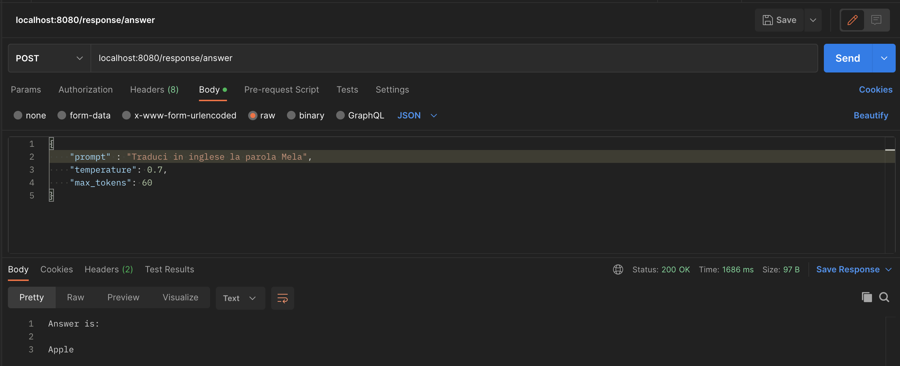

# OPEN AI WITH SPRINGBOOT
## Intro
This is a sample SpringBoot project to query the OpenAI API (included ChatGPT, DALL-E, ecc)

## How to get it running
* Clone this GIT project;
* Create an Account at https://openai.com and login;
* Go to https://beta.openai.com/account/api-keys and create a Secret API Key;
* Define an environment variable in your IDE called OPENAI_SECRET_KEY and put here the value of the secret key or 
simply paste the value of the key in the application.yml file;
* Start it as Spring Boot application;
* Now can query ChatGPT at http://localhost:8080/

## Account balance
You can check your cash balance (usually you should have 18$ free trial) at https://platform.openai.com/account/usage

## Sample Request

## Other links
* https://platform.openai.com/docs/models
